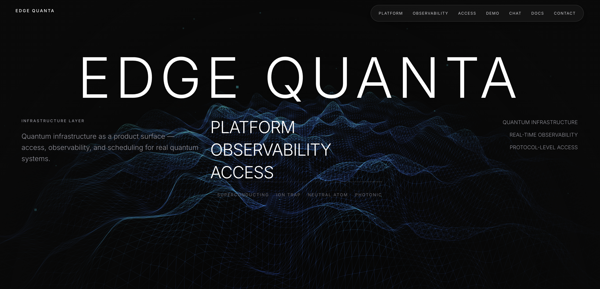

# EDGE QUANTA

**Quantum as a Service — real hardware, edge-delivered.**

Edge Quanta is the infrastructure layer that makes superconducting quantum computers usable like managed cloud compute. We connect researchers, engineers, and enterprises to real quantum hardware through a single API — with the observability, scheduling, and reliability they expect from modern infrastructure.

> Built by [Bitquanta](https://bitquanta.com)

---

## What It Does

Edge Quanta sits between users and quantum hardware. It provides the access, control, and observability layer needed to operate real quantum devices as a service.

| Capability | Description |
|---|---|
| **Job Submission** | Submit quantum circuits to real superconducting chips (up to 180 qubits) via a simple API |
| **Async Execution** | Track job lifecycle from queued → compiling → running → completed with real-time status |
| **Result Retrieval** | Pull measurement counts, probabilities, and fidelity metrics for any completed job |
| **Observability** | Monitor queue depth, chip calibration age, system health, and qubit performance |
| **Scheduling** | Reserve exclusive machine time windows for priority workloads |
| **AI-Assisted Research** | Built-in agentic assistant that can search literature, run experiments, and analyze results |

---

## Supported Hardware

Edge Quanta connects to the **Origin Quantum Cloud**, providing access to real superconducting quantum processors:

- **72-qubit chip** — production superconducting processor
- **WK_C102** — 102-qubit superconducting chip
- **WK_C180** — 180-qubit superconducting chip (largest available)
- **Full / Single / Partial Amplitude Simulators** — up to 200-qubit simulation

---

## Architecture

Edge Quanta runs entirely at the edge. The platform is deployed on Cloudflare's global network — no origin servers, no cold starts, no regional bottlenecks.

- **Frontend** — React SPA served from Cloudflare Pages
- **Backend** — TypeScript API running as Cloudflare Pages Functions
- **Database** — Cloudflare D1 (SQLite at the edge) for job tracking and state
- **AI** — Anthropic Claude with tool-use for agentic research and experiment execution

---

## Who It's For

- **Research labs** running experiments on real quantum hardware
- **Enterprise R&D teams** evaluating quantum advantage for optimization, simulation, and search
- **Quantum software developers** building applications on top of real backends
- **Hardware operators** looking for a commercial access layer for their systems

---

## Product Thesis

Most teams focus on quantum algorithms. The immediate commercial opportunity is lower in the stack: **access, orchestration, reliability, observability, and scheduling.**

That is the layer Edge Quanta is designed to own.

> Edge Quanta makes quantum hardware usable like cloud infrastructure.

---

## Status

Edge Quanta is in active development. The platform is live at [edgequanta.pages.dev](https://edgequanta.pages.dev).

---

## License

Proprietary. © Bitquanta. All rights reserved.